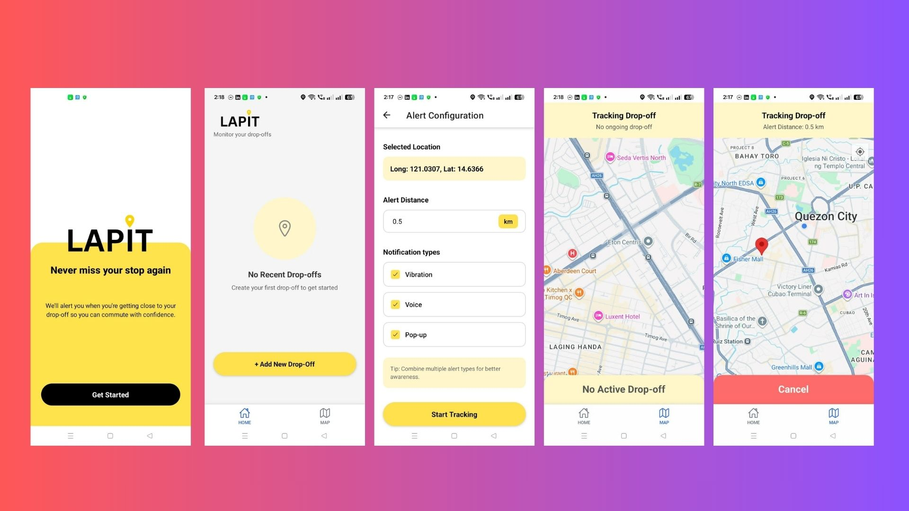

# Lapit
### Your Personal Commuter Drop-off Alert App

> **Never miss your stop again.**  
> Lapit alerts you when you're approaching your drop-off point — perfect for commuters who fall asleep, get distracted, or just lose track of where they are on the route.

---



---

## What is Lapit?

**Lapit** (Filipino for *close/near*) is a mobile app built with React Native and Expo that monitors your real-time GPS location and **alerts you when you're close to your drop-off stop** — so you never miss it again while riding a bus, jeepney, UV Express, or any commuter vehicle.

### The Problem It Solves
- Falling asleep on long commutes
- Getting too distracted on your phone
- Not being familiar with a new route
- Poor visibility during bad weather

---

## Features

- Real-time GPS tracking
- Proximity alert when approaching drop-off point
- Set your drop-off location on a map
- Customizable alert radius
- Sound + vibration notifications
- Runs in the background while you commute

---

## Getting Started

### Prerequisites

- [Node.js](https://nodejs.org/) (v18 or later)
- [Expo CLI](https://docs.expo.dev/get-started/installation/)
- [Expo Go](https://expo.dev/go) app on your mobile device

---

### Clone the Repository

```bash
git clone https://github.com/YOUR_USERNAME/lapit-commuter-app.git
cd lapit-commuter-app
```

> Replace `YOUR_USERNAME` with your actual GitHub username.

---

### Install Dependencies

```bash
npm install
```

---

### Start the App

```bash
npx expo start
```

In the output, you'll find options to open the app in a:

- [Expo Go](https://expo.dev/go) — scan the QR code on your phone
- [Android Emulator](https://docs.expo.dev/workflow/android-studio-emulator/)
- [iOS Simulator](https://docs.expo.dev/workflow/ios-simulator/)
- [Development Build](https://docs.expo.dev/develop/development-builds/introduction/)

---

## Project Structure

```
lapit-commuter-app/
├── app/                  # File-based routing (Expo Router)
│   ├── index.tsx         # Home / main screen
│   └── ...
├── assets/
│   └── images/
│       └── lapit-ad.jpg  # App banner
├── components/           # Reusable UI components
├── hooks/                # Custom hooks (e.g., location tracking)
└── README.md
```

---

## Built With

- [React Native](https://reactnative.dev/)
- [Expo](https://expo.dev/)
- [Expo Location](https://docs.expo.dev/versions/latest/sdk/location/) — for GPS tracking
- [Expo Notifications](https://docs.expo.dev/versions/latest/sdk/notifications/) — for alerts
- [React Native Maps](https://github.com/react-native-maps/react-native-maps) — for map UI

---

## Reset the Project

To start fresh with a clean slate:

```bash
npm run reset-project
```

This moves the starter code to `app-example/` and gives you a blank `app/` directory.

---

## Learn More

- [Expo Documentation](https://docs.expo.dev/)
- [Expo Router](https://docs.expo.dev/router/introduction/)
- [React Native Docs](https://reactnative.dev/docs/getting-started)

---

## Contributing

This is a personal project, but feel free to fork it, suggest improvements, or report bugs via [Issues](https://github.com/YOUR_USERNAME/lapit-commuter-app/issues).

---

## Author

Made with love by **Al Francis Daga-ang**  
Built to solve a real daily commuter problem.

---

## License

This project is open source and available under the [MIT License](LICENSE).